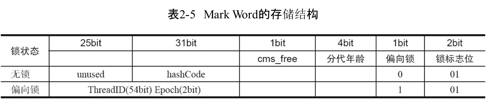

# 准备工作
* 知识基础：四把锁的概念（无锁状态、偏向锁（匿名偏向锁）、自旋锁、重量级锁）
* 工具基础：JOL包
```mxml
<dependency>
    <groupId>org.openjdk.jol</groupId>
    <artifactId>jol-core</artifactId>
    <version>0.10</version>
</dependency>
```

* 资料基础



# 测试代码
```java
public class LockTest {
    public static void main(String[] args) {
        A a1 = new A();
        printInfo("刚启动new的实例", a1);
        try {
            // 睡6s等JVM开默认偏向锁
            Thread.sleep(6000);
        } catch (InterruptedException e) {
            e.printStackTrace();
        }
        A a2 = new A();
        printInfo("等待之后JVM开的偏向锁", a2);
        String hashCodeString = Integer.toBinaryString(a2.hashCode());
        System.out.println("hashCode:" + hashCodeString);
        int end = hashCodeString.length();
        System.out.println("按字节（8位）倒排hashCode");
        for (; end > 0; end -= 8) {
            System.out.print(hashCodeString.substring(Math.max(end - 8, 0), end) + " ");
        }
        printInfo("调用了方法后的实例", a2);

        synchronized (a2) {
            printInfo("在主线程锁了一下a2", a2);
        }
        printInfo("主线程解锁了a2", a2);

        System.out.println("开始尝试并发情况下的锁");
        int threadNum = 2;
        CountDownLatch count = new CountDownLatch(threadNum);
        for (int i = 0; i < threadNum; i++) {
            int finalI = i;
            new Thread(
                    () -> {
                        try {
                            count.await();
                        } catch (InterruptedException e) {
                            e.printStackTrace();
                        }
                        if (finalI < 1) {
                            try {
                                System.out.println("thread_" + finalI + "睡了一会");
                                Thread.sleep(200);
                            } catch (InterruptedException e) {
                                e.printStackTrace();
                            }
                        }
                        synchronized (a2) {
                            System.out.println("thread_" + finalI + "给a2上了锁");
                            printInfo("上自旋锁的a2", a2);
                            a2.a++;
                        }
                    }
            ).start();
            count.countDown();
        }
        try {
            //睡个一会防止重量级锁影响自旋锁
            System.out.println("睡了10s，防止重量级锁影响自旋锁");
            Thread.sleep(10000);
        } catch (InterruptedException e) {
            e.printStackTrace();
        }
        CountDownLatch count1 = new CountDownLatch(threadNum);
        for (int i = 2; i < threadNum + 2; i++) {
            int finalI = i;
            new Thread(() -> {
                try {
                    count.await();
                } catch (InterruptedException e) {
                    e.printStackTrace();
                }
                synchronized (a2) {
                    System.out.println("thread_" + finalI + "给a2上了锁");
                    printInfo("上重量级锁的a2", a2);
                    a2.a++;
                }
            }).start();
            count1.countDown();
        }
    }

    private static void printInfo(String remark, A a) {
        System.out.println(remark + "\n" + ClassLayout.parseInstance(a).toPrintable());
    }
}
```

# 结果
**结果的查看方法**：看第一组8个数的最后两位  
以第一个例子为例：00000<font color=blue>0</font><font color=yellow>01</font> 00000000 00000000 00000000  
黄色的就是锁标志位，蓝色的在标志位为01的时候是偏向锁标志位  
原理：内存中是倒着排序的——这能够让取值变得简单并使强转功能变得轻松

```html
刚启动new的实例
com.lifelearning.concurrent.test.lock.A object internals:
 OFFSET  SIZE   TYPE DESCRIPTION                               VALUE
      0     4        (object header)                           01 00 00 00 (00000001 00000000 00000000 00000000) (1)
      4     4        (object header)                           00 00 00 00 (00000000 00000000 00000000 00000000) (0)
      8     4        (object header)                           43 c1 00 f8 (01000011 11000001 00000000 11111000) (-134168253)
     12     4    int A.a                                       0
Instance size: 16 bytes
Space losses: 0 bytes internal + 0 bytes external = 0 bytes total

等待之后JVM开的偏向锁
com.lifelearning.concurrent.test.lock.A object internals:
 OFFSET  SIZE   TYPE DESCRIPTION                               VALUE
      0     4        (object header)                           05 00 00 00 (00000101 00000000 00000000 00000000) (5)
      4     4        (object header)                           00 00 00 00 (00000000 00000000 00000000 00000000) (0)
      8     4        (object header)                           43 c1 00 f8 (01000011 11000001 00000000 11111000) (-134168253)
     12     4    int A.a                                       0
Instance size: 16 bytes
Space losses: 0 bytes internal + 0 bytes external = 0 bytes total

hashCode:1100011101000010101101000
按字节（8位）倒排hashCode
01101000 10000101 10001110 1 调用了方法后的实例

/*
下面第一个头倒序排列一下
倒序排列第一个对象头：    00000100 10001011 11111101 00000001
对象的hashCode：01100110 00000100 10001011 11111101
第二行的最后一个字节（就是第一段）：01100110 就是hashCode的第一段。
这么看其实内存中的实例的字节排列都是反过来的（但是每一字节的二进制的顺序是正序的）—— 值不变，顺序反
*/

com.lifelearning.concurrent.test.lock.A object internals:
 OFFSET  SIZE   TYPE DESCRIPTION                               VALUE
      0     4        (object header)                           01 68 85 8e (00000001 01101000 10000101 10001110) (-1903859711)
      4     4        (object header)                           01 00 00 00 (00000001 00000000 00000000 00000000) (1)
      8     4        (object header)                           43 c1 00 f8 (01000011 11000001 00000000 11111000) (-134168253)
     12     4    int A.a                                       0
Instance size: 16 bytes
Space losses: 0 bytes internal + 0 bytes external = 0 bytes total

在主线程锁了一下a2
com.lifelearning.concurrent.test.lock.A object internals:
 OFFSET  SIZE   TYPE DESCRIPTION                               VALUE
      0     4        (object header)                           60 89 88 07 (01100000 10001001 10001000 00000111) (126388576)
      4     4        (object header)                           00 70 00 00 (00000000 01110000 00000000 00000000) (28672)
      8     4        (object header)                           43 c1 00 f8 (01000011 11000001 00000000 11111000) (-134168253)
     12     4    int A.a                                       0
Instance size: 16 bytes
Space losses: 0 bytes internal + 0 bytes external = 0 bytes total

主线程解锁了a2
com.lifelearning.concurrent.test.lock.A object internals:
 OFFSET  SIZE   TYPE DESCRIPTION                               VALUE
      0     4        (object header)                           01 68 85 8e (00000001 01101000 10000101 10001110) (-1903859711)
      4     4        (object header)                           01 00 00 00 (00000001 00000000 00000000 00000000) (1)
      8     4        (object header)                           43 c1 00 f8 (01000011 11000001 00000000 11111000) (-134168253)
     12     4    int A.a                                       0
Instance size: 16 bytes
Space losses: 0 bytes internal + 0 bytes external = 0 bytes total

开始尝试并发情况下的锁
睡了10s，防止重量级锁影响自旋锁
thread_0睡了一会
thread_1给a2上了锁
上自旋锁的a2
com.lifelearning.concurrent.test.lock.A object internals:
 OFFSET  SIZE   TYPE DESCRIPTION                               VALUE
      0     4        (object header)                           f8 c8 a6 08 (11111000 11001000 10100110 00001000) (145148152)
      4     4        (object header)                           00 70 00 00 (00000000 01110000 00000000 00000000) (28672)
      8     4        (object header)                           43 c1 00 f8 (01000011 11000001 00000000 11111000) (-134168253)
     12     4    int A.a                                       0
Instance size: 16 bytes
Space losses: 0 bytes internal + 0 bytes external = 0 bytes total

thread_0给a2上了锁
上自旋锁的a2
com.lifelearning.concurrent.test.lock.A object internals:
 OFFSET  SIZE   TYPE DESCRIPTION                               VALUE
      0     4        (object header)                           f8 38 12 08 (11111000 00111000 00010010 00001000) (135411960)
      4     4        (object header)                           00 70 00 00 (00000000 01110000 00000000 00000000) (28672)
      8     4        (object header)                           43 c1 00 f8 (01000011 11000001 00000000 11111000) (-134168253)
     12     4    int A.a                                       1
Instance size: 16 bytes
Space losses: 0 bytes internal + 0 bytes external = 0 bytes total
```